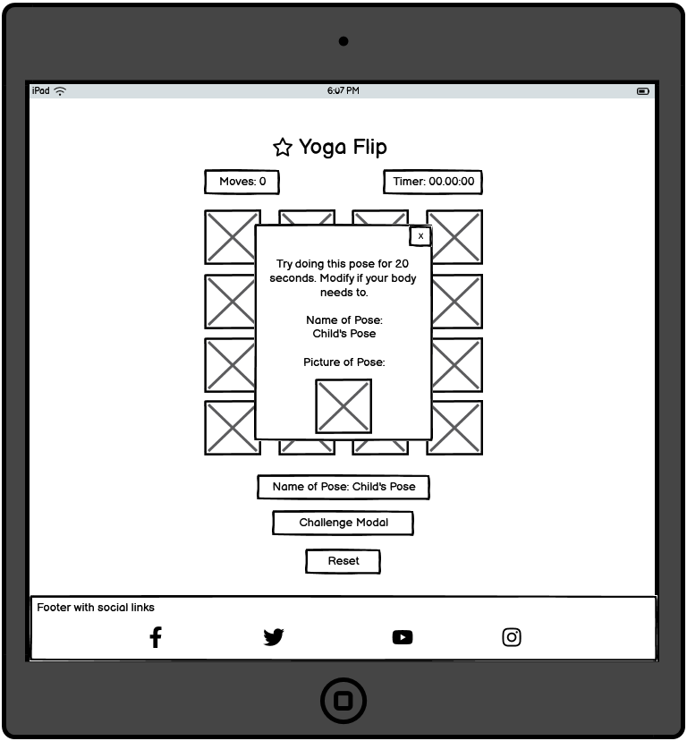

# Yoga Flip

(Developer: Katie Dunne)

AmIResponsive Image

## Live website

Link to live website: 

## Purpose of the project

Yoga Flip is a version of the classic card memory game. It provides value to the user through an educational aspect. This game gives the name of the yoga pose shown on the cards, after each successful match. There is a bonus challenge feature to this game where the user can click the 'challenge' button at any time during the game and get a random pose shown to them and they are challenged to do the pose for 20 seconds if their fitness allows. There are also social links in the footer of the main game page to encourage the user to connect with the yoga studio business, which offers in-person classes. The color theme of yoga flip was specifically chosen to provide feel-good and energizing emotions. Bright anchor colors were chosen. These are; purple, pink and white. The whole theme of this project is based around energising Vinyasa yoga.

## Table of contents

  * [User experience (UX)](#user-experience-ux)
  * [User stories](#user-stories)
  * [Features](#features)
  * [Future features](#future-features)
  * [Design](#design)
  * [Wireframes](#wireframes)
  * [Technology](#technology)
  * [Testing](#testing)
  * [Deployment](#deployment)
  * [Credits](#credits)
  * [Acknowledgements](#acknowledgements)

## User experience (UX)

### Key project goals

### Target audience

### User requirements and expectations

## User stories

## Features

### Main Game Page

### Modal

## Design

### Design Choices

Vinyasa, purple, pink, energy.
### Typography

### Color

Since this business offers outdoor services such as horse riding lessons I chose earthy colors. I also kept accessibility in mind when choosing colors and I used a color blind friendly palette for inspiration. Colors were adapted from palettes generated using [Venngage's accessible color palette generator](https://venngage.com/tools/accessible-color-palette-generator).

Primary Colors - White / Purple

Secondary Colors - Pink

## Wireframes

### Index Page Wireframes

### Challenge Modal Wireframes

## Technology

### Languages

- HTML
- CSS
- JavaScript

### Frameworks & Tools

- [Git](https://git-scm.com/)
- [GitHub](https://github.com/)
- [Visual Studio Code IDE](https://code.visualstudio.com/)
- [Balsamiq](https://balsamiq.com/wireframes/)
- [Favicon](https://favicon.io/favicon-generator/#google_vignette)
- [Venngage's Accessible color palette generator](https://venngage.com/tools/accessible-color-palette-generator)
- [Google Fonts](https://fonts.google.com/)
- [Font Awesome](https://fontawesome.com/)
- [W3C Markup Validation Service](https://validator.w3.org/)
- [W3C CSS Validation Service](https://jigsaw.w3.org/css-validator/)
- [Google Lighthouse](https://chrome.google.com/webstore/detail/lighthouse/blipmdconlkpinefehnmjammfjpmpbjk)
- [Chrome DevTools](https://developer.chrome.com/docs/devtools/)
- [Google Maps](https://www.google.com/maps)
- [YouTube](https://www.youtube.com/)

## Testing

### Code validation

#### HTML validation

#### CSS validation

### Accessibility and Lighthouse

### Manual testing

#### Responsiveness of features tested using Chrome DevTools

#### Browser compatibility testing

#### Testing all links on the site

### Feature testing table

### User story testing

### Fixed bugs

### Unfixed bugs

### Supported screens and browsers

#### Screens

 - iPhone SE, 375px wide. Also looks good down to 300px according to devtools
 - iPad Mini, 768px wide
 - Nest Hub Max, 1280px wide

#### Browsers

 - Chrome
 - Edge
 - Firefox
 - Safari
 - Opera

## Deployment

### How this site was deployed

- In the GitHub repository, go to the Settings tab, then choose Pages from the left hand menu
- Make sure that source is set to 'Deploy from Branch'
- Main branch needs to be selected and folder should be set to root
- Under branch, click save
- Revisit the code tab and wait a few minutes for the build to finish, then refresh your repository
- There will be an option to click on 'github-pages', on the right hand side, in the environments section
- Click on 'view deployment' to see the live site.

  The live link can be found here -

## Credits

### Code

Love Maths

### Media

### Inspiration from other memory game websites

### Inspiration from other yoga websites

### Inspiration for structure from other CI students

## Acknowledgements

Thank you to friends, family and pets for the massive support. Also thank you to Laura, the leader of our CI cohort :sparkles: