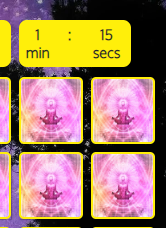
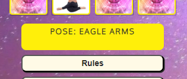
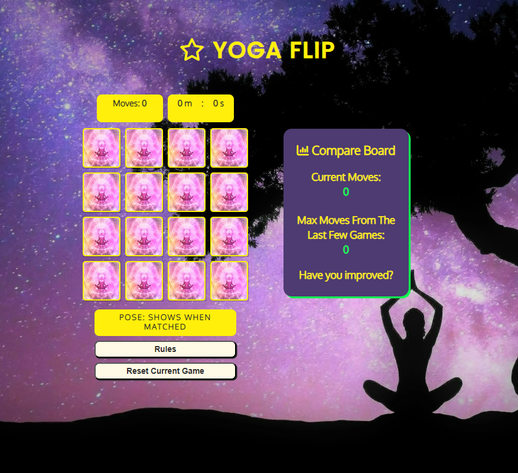
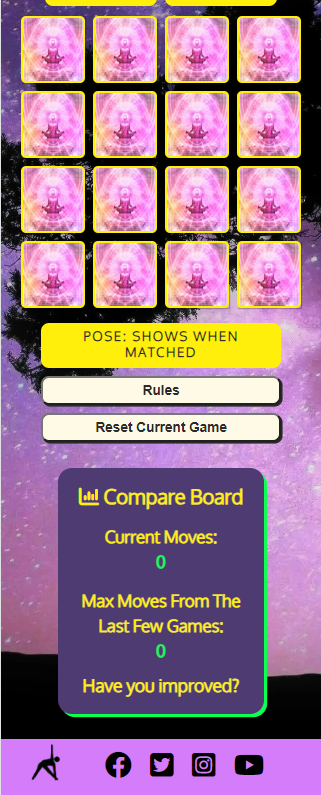
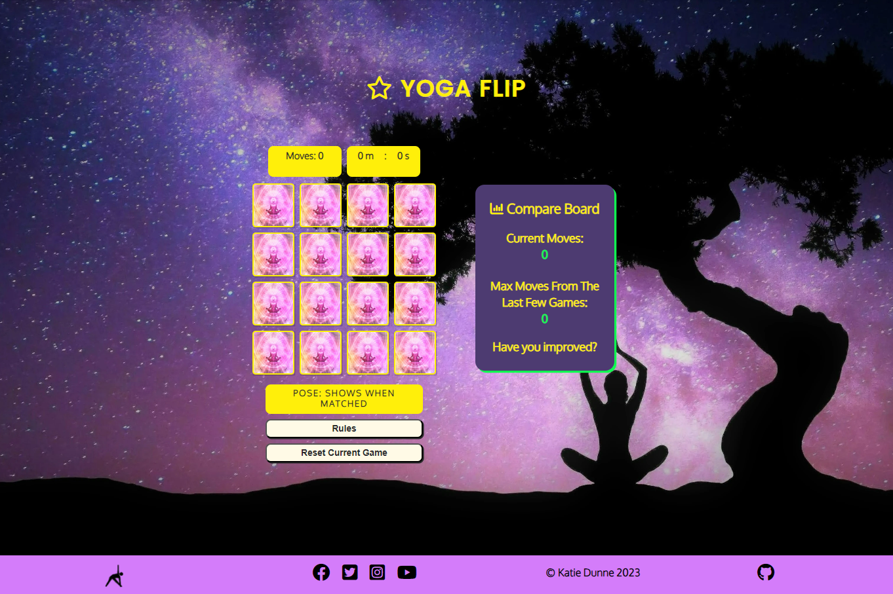

# Yoga Flip

(Developer: Katie Dunne)

## Live website

Link to live website: [Yoga Flip](https://ksdunne.github.io/yoga_flip/)

## Purpose of the project

Yoga Flip is a version of the classic card memory game. It provides value to a user of any age through an educational aspect. The educational aspect is that the game gives the name of the yoga pose shown on the cards, after each successful match. Therefore, the user is learning the name of each yoga pose as they are playing the game. The game is also challenging, because the player is playing against a countdown timer. When the timer reaches zero the grid playing area fades away and a 'Time Out!' slogan appears. There are also social links in the footer of the main game page to encourage the user to connect with a yoga studio business, which offers in-person classes. The color theme of yoga flip was specifically chosen to provide feel-good and energizing emotions. Bright anchor colors were chosen. These are; purple, yellow, light pink, bright pink and bright green. These colors were also inspired by accessible color palettes. The whole theme of this project is based around energising Vinyasa yoga.

## Table of contents

- [User experience (UX)](#user-experience-ux)
- [User stories](#user-stories)
- [Features](#features)
- [Future features](#future-features)
- [Design](#design)
- [Wireframes](#wireframes)
- [Technology](#technology)
- [Testing](#testing)
- [Deployment](#deployment)
- [Credits](#credits)
- [Acknowledgements](#acknowledgements)

## User experience (UX)

### Key project goals

- Create an interactive memory game with a yoga theme that uses feel-good colors and striking images, while always keeping accessibility in mind
- Make a game that provides value to the user through an educational aspect
- Make a game that lets the user initiate the countdown timer and gives feedback through the display of each yoga pose name, when cards are successfully matched
- Make the game responsive on multiple screen sizes
- Use a defensive design
- Show the user is making progress when they play the game a couple of times, through the use of local storage
- Create a real world aspect, by putting links to socials in the footer, because users might be interested in booking classes at an in-person yoga studio

### Target audience

- Users of any age that would like to play a fun game online
- People of any age that would like to practice their memory skills
- People that are interested in yoga
- People that are interested in learning the names of popular yoga poses
- People that might be interested in joining an in-person yoga class

### User requirements and expectations

- An accessible website / game for all users
- A visually appealing memory game and intuitively structured website / game. For example, there is feedback when cards are clicked, rules button is easy to find and reset button is easy to find
- A webpage that is responsive on all screen sizes
- A website / game that loads quickly on all devices and connections
- An ability to track the amount of moves made
- A fun way to be challenged against the computer, with a countdown timer which leads to a time-out page
- Feedback when the user wins a game, through the use of an animation
- A way to learn the names of popular yoga poses
- An ability to reset the board, move-number and timer
- A defensive design, so that the user does not reset their game prematurely by accident
- A way to see if they are they improving as they play the game a few times
- Ability to quickly find social links which would help them find a yoga business for classes

## User stories

- As a site visitor, I am first assessing if this is an intuitive and eye-catching game that I would like to play
- As a site visitor, I will initially see a grid style game with 16 cards.
- As a site visitor, I will initially be able to see the back-side of the cards
- As a site visitor, I will see that the timer starts when I flip the first card
- As a site visitor, I will be able to click two cards at a time. They will flip over and stay flipped over if I have matched them
- As a site visitor, I will see that a move is logged when the second card is flipped
- As a site visitor, I will see that the countdown timer stops once I finish matching all of the 16 cards on the grid
- As a site visitor, I will be able to click a button that says "rules" and the rules of the game will pop up. This will pop up via a modal
- As a site visitor, I will be able to close this modal whenever I want and return to where I was in the game
- As a site visitor, I will be able to click a "reset" button at any time during the game
- As a site visitor, I will make use of the defensive design in the reset button by confirming what I would like to do, whether that is continue playing the game I was playing or reset all cards, timer and current moves
- As a site visitor, I will be able to see links in the footer to social media, where I can search for yoga studios if I would like to do that. This will encourage me to a local yoga studio for in-person lessons
- As a site visitor, I will get feeback when the countdown timer reaches zero and I will get feed back when I win a game. Both of these feedback mechanisms will be animations
- As a site visitor, I can see the max amount of moves I made in the last few times I played the game through local storage and I can compare this number to my current move number
- Overall, as a site visitor, the value I get from this site is; I have fun, I am challenged by the countdown timer, I learn the names of the yoga poses and I can also find ways to contact an in-person yoga studio

## Features

### Main Game Page

#### Title of game with icon

A responsive game title is in place. The size of the font and padding changes with screen size. A font awesome star logo was used. A star was chosen to mesh with the sky themed background.

#### Moves tracker

There is a moves tracker in place. The moves tracker only increments by 1 when you mismatch 2 cards. The number increments when the 'unflipCards' function is called.

#### Countdown timer

There is a countdown timer feature on this game. The timer only starts once the user clicks on the first card. Once it hits zero the main game content is hidden and a "new page" appears to the user that exclaims "Time Out!"

#### Grid of 16 cards

There are 16 cards in a grid to form a memory game with a yoga theme. The picture that was chosen for the back of the cards represents meditation, which is often associated with yoga. The yoga pictures are of a real person. The idea of using cartoons was considered but the real person picture is more relatable, which will add to a feel-good emotion when playing the game. The real person picture is also educational as it is a demonstation of the yoga pose that the user could try themselves.

#### Name of pose on the cards that have just been matched

When there is a successful match, the name of the pose that was just matched is shown in a box below the grid. This is educational, as it gives the name of the pose in layman's terms.

#### Rules button

Once the rules button is clicked a modal pops up. A light pink color was used for this just in case button colors are not supported on all browsers, then at least the light color theme still fits in. The rules button uses a pointer curser. The rules button is placed under the gird and pose name div, so that it is easy to find.

#### Reset current game button with a defensive design

There is a reset button in an easy to find place, under the rules button. This button also uses a pointer curser. A defensive design was implemented here, because the user could click reset by an accident and lose the progress of their game while in the middle of playing. So to combat this potential accident, the board does not reset straight away when the reset button is clicked. Instead a modal pops up to ask the user "Are you sure you want to reset the cards?". The modal has 2 buttons with options to continue playing or to indeed reset the cards, current move counter and timer.

#### Responsive compare board with a local storage feature

The compare board has a heading with a font awesome icon. The icon represents a barchart because the user is expected to compare their current score with the maximum of resent scores in local storage. This is a way for the user to track their own progress and see are they finishing the game is less moves now than when they started playing the game. The compare board is responsive. It is displayed under the grid and buttons while on a mobile screen. It displays beside the main playing grid on tablet sized screens and upward.

#### Responsive footer with social links and logo

The footer uses a flexbox display. Social media links are in the footer in case a user would like to find yoga studios for in-person classes. The logo is of a person in a typcal stretching movement. The logo was initially clickable, however after a while the click feature was considered a bad design. This is because it reset the cards, move count of current game and timer. Therefore, the click feature was taken off the logo to aid a more defensive design.

#### Attractive background that doesn't distract from the foreground

The background image was chosen, because it has attractive colours that mesh with the overall theme. It shows a shadow of a person with their legs crossed in a typical yoga manner and a shadow of a tree. The background was initally a bit brighter than it is now, however after peer feedback it was blurred and darkened a bit, so that it does not distract from the foreground.

#### Favicon

The color of the favicon was chosen to mesh with the overall theme of Yoga Flip. There is a capital Y in the center of a circle. The Y represents the name of the game and the color makes the page easy to locate among other open tabs.

### Modals and animations

#### Rules modal

The rules modal can be opened before a game or during a game. This will not interfere with the game. It can be closed by clicking on the dark colored background on the outside of the modal or by clicking the play button that is on the modal card. There is a con associated with the rules modal in that, the time does not stop running when you are reading the rules if you open it mid game. Perhaps a pause in this instance could be a future feature.

#### Rules modal play button

The play button brings the user back to where they were in the game. If this was before a game had started this will have no effect on the game. If the game has already started the time will have continued to run, but the cards will still be in the same state as they were when the modal was opened.

#### Reset modal

A modal pops up when the reset button is clicked in order to implement a defensive design. If the modal was not in place the game would have reset instantly which wouldn't be good user experience. Clicking outside of the modal has the same effect as clicking the continue playing button.

#### Reset modal buttons for continue play or reset

The continue playing and reset buttons of the reset modal have a pointer cursor. The continue play button will bring the user back to where they were in the game, however time will have passed by. The reset button resets the cards, move count and countdown timer.

#### Time out page

The 'timer-running' content fades out and the 'timer-end' content fades in the moment the timer reaches zero. The time out content shows the yoga flip heading, the amount of moves the user has taken up until the time out and it shows the time at zero. There is a 'Time Out!' exclamation and a start over button with a pointer cursor that has the same action as the reset button except without the modal.

#### Win page

The win page has a similar animation to the time out page but it appears when the user hits 8 matches. The win content shows the yoga flip heading, the amount of moves the user has taken to win the game and it shows the time you were at when you won the game. There is a 'Win!' exclamation and a start over button with a pointer cursor that has the same action as the reset button except without the modal.

## Future Features

- A 404 page
- An option to input a username
- Multiple levels of difficulty, where there are more tiles in the grid or a shorter countdown time (e.g. easy, medium or hard levels)
- A scoreboard that displays the last 10 scores
- A video that demonstrates yoga poses
- Fun sounds when the cards are flipped
- Fun sounds when the cards are matched
- Music playing while you play the game
- Sounds that have the option to be turned on or off by the user, so the control of the sounds is in the hands of the user

## Design

### Design Choices

### Typography

Google Fonts were used to import Poppins and Oxygen fonts into styles.css. A sans-serif generic font was chosen as a back-up. These were chosen as they are easy to read and sans-serif fonts are common in modern website design.

### Color

The theme for this game is energising Vinyasa yoga. Bright colors were chosen, that give the user an energetic feeling. Accessibility was also kept in mind when choosing colors. Color blind friendly palettes were used for inspiration. Colors were adapted from palettes generated using [Venngage's accessible color palette generator](https://venngage.com/tools/accessible-color-palette-generator).

#### Primary accessible color palette

The primary colors for this page are: Purple / Green / Yellow. The purple color, #D47CFA, was chosen from the palette below. The palette below also shows that green is an accessible contrast to purple.

#### Secondary accessible color palette

The pink color on the palette below was used as inspiration when picking the back side image of the cards. The dark purple was used as inspiration for the background color of the compare board. I couldn't use that exact purple as it needed to be even darker for high contrast.

## Wireframes

The structure of the grid part of the game stayed the same from the inception of the first wireframes. However, due to this being a JavaScript project, features were continually added after mentor discussions. Therefore, the wireframes kept evolving during this project. This was in contrast to the first Code Institute project where the finished website was very much in line with the first set of wireframes.

### Index page wireframes

### Rules modal wireframes

### Are you sure modal wireframes

### Time out screen wireframes

### Win screen wireframes

## Technology

### Languages

- HTML
- CSS
- JavaScript

### Frameworks & Tools

- [Git](https://git-scm.com/)
- [GitHub](https://github.com/)
- [Visual Studio Code IDE](https://code.visualstudio.com/)
- [Prettier Code Formatter](https://prettier.io/)
- [Balsamiq](https://balsamiq.com/wireframes/)
- [Favicon](https://favicon.io/favicon-generator/#google_vignette)
- [Venngage's Accessible color palette generator](https://venngage.com/tools/accessible-color-palette-generator)
- [Google Fonts](https://fonts.google.com/)
- [Font Awesome](https://fontawesome.com/)
- [W3C Markup Validation Service](https://validator.w3.org/)
- [W3C CSS Validation Service](https://jigsaw.w3.org/css-validator/)
- [JSHint](https://jshint.com/)
- [Chrome DevTools](https://developer.chrome.com/docs/devtools/)
- [Google Lighthouse](https://chrome.google.com/webstore/detail/lighthouse/blipmdconlkpinefehnmjammfjpmpbjk)

## Testing

### Code validation

#### HTML validation

- No errors or warnings returned on index.html when the official W3C validator was used. There were info messages that were concerned with the trailing slash on self closing tags. This is due to using the prettier extension in VS Code. From reading the following resource, it was concluded the info messages can be safely ignored in this instance. They can be ignored because all of the attributes in this project are quoted. See [link to resource](https://github.com/prettier/prettier/issues/5641). See the [Index Page Test](https://validator.w3.org/nu/?doc=https%3A%2F%2Fksdunne.github.io%2Fyoga_flip%2F)

#### CSS validation

- No errors found using Jigsaw CSS validator. See [CSS Test](https://jigsaw.w3.org/css-validator/validator?uri=https%3A%2F%2Fksdunne.github.io%2Fyoga_flip%2F&profile=css3svg&usermedium=all&warning=1&vextwarning=&lang=en)

#### JS Hint

- No errors or warnings were returned on JSHint. It states 1 unused variable on line 281, however this is not unused. It is called in the index.html file using onclick.

### Accessibility and Lighthouse

- A score of 100 was reached for accessibility and SEO. High green scores were reached for performance and best practices.

### Manual testing

#### Responsiveness was tested using Chrome DevTools

- All features were tested for the intended responsiveness using Chrome DevTools on iPhone SE, 375px wide, iPad Mini, 768px wide and Nest Hub Max, 1280px wide

- Responsiveness was also consistently tested down to 300px throughout development

- At the end of development, all features passed responsiveness testing and looked good on all mentioned devices

- See responsive feature testing results in the table below

| responsiveness           | feature | responsiveness bugs |
| ------------------------ | ------- | ------------------- |
| game title h1            | pass    | na                  |
| compare board            | pass    | na                  |
| compare board text       | pass    | na                  |
| footer                   | pass    | na                  |
| rules modal card         | pass    | na                  |
| rules modal list         | pass    | na                  |
| rules modal button       | pass    | na                  |
| are you sure card        | pass    | na                  |
| are you sure question    | pass    | na                  |
| are you sure buttons     | pass    | na                  |
| time out page h1         | pass    | na                  |
| time out page background | pass    | fixed with extra vh |
| win page h1              | pass    | na                  |
| win page background      | pass    | fixed with extra vh |

#### Browser compatibility testing

#### Testing all links on the site

### Feature testing table

### User story testing

### Fixed bugs

- Height was specified in header style and the content then spilled over to the next element. This was fixed by removing the specific height and then the header height just changed automatically to fit the content which was much better.

### Unfixed bugs

### Supported screens and browsers

#### Screens

- iPhone SE, 375px wide. Also looks good down to 300px according to devtools
- iPad Mini, 768px wide
- Nest Hub Max, 1280px wide

#### Browsers

- Chrome
- Edge
- Firefox
- Safari
- Opera

## Deployment

### How this site was deployed

- In the GitHub repository, go to the Settings tab, then choose Pages from the left hand menu
- Make sure that source is set to 'Deploy from Branch'
- Main branch needs to be selected and folder should be set to root
- Under branch, click save
- Revisit the code tab and wait a few minutes for the build to finish, then refresh your repository
- There will be an option to click on 'github-pages', on the right hand side, in the environments section
- Click on 'view deployment' to see the live site.

  The live link can be found here -

## Credits

### Code

Love Maths

[Grid Game Medium Tutorial](https://medium.com/free-code-camp/vanilla-javascript-tutorial-build-a-memory-game-in-30-minutes-e542c4447eae/)

[CI Student Memory Card Game 1](https://github.com/moirahartigan/Portfolio-2---Alien-Memory-Game/tree/master)

[CI Student Memory Card Game 2](https://github.com/Kathrin-ddggxh/CI-PP2_memory-card-game)

### Media

### Inspiration from other memory game websites

### Inspiration from other yoga websites

### Inspiration for structure from other CI students

## Acknowledgements

Thank you to friends, family and pets for the massive support. Also thank you to my mentor and the leader of our CI cohort :sparkles:
